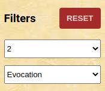
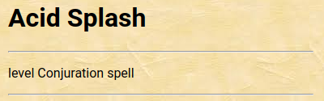
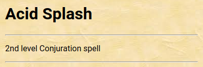

# Majisti's Interview Challenge

## Your Task

This challenge will require you to fix a few unit tests. The project is completely ready for you to start fixing the
issues, without having to fumble with project setup. In other words, none of the issues are from the project's
configuration; they are all code-related.

Find the bugs, fix the source code, make automated tests green. Bam, you're all done!

## The App

Guyllaume (who built this project) is a huge D&D nerd. As such, the app is a small application that lists, via an API,
available spells (magical abilities) in the game.

It is built with react and redux, via the [create-react-app][1] project. It uses a [free to use API][2] to fetch
information about the spells.

**➡️ Don't worry, you don't need to know anything about Dungeons & Dragons!**

## Installation

You have many options, the easiest being via Docker. Otherwise, using your global installation of node will also work.
We use [yarn][5] as the package manager. You can use npm, but there is no `package-lock.json` file so results might be
unpredictable.

In both cases, the project will be available at [http://localhost:3000][4].

### With Docker

We use [make][3] to simplify interactions with the project. You can run
`make help` to see all available commands. That being said, **to install the project**, run:

```shell
make && make start
```

### With node and yarn

You'll know how it works, but in case:

```shell
yarn && yarn start
```

## Running Tests

In your IDE, you should be all set to run them. You can also run the whole suite via command line:

```shell
# docker - you have two options:
make test
bin/yarn test

# node/yarn
yarn test
```

If you prefer running your tests in watch mode:

```shell
# docker
make test-watch
bin/yarn test:watch

# node/yarn
yarn test:watch
```

### Running A Single Test

Webstorm, by default, will allow you to run tests individually. Additionally, Jest's watch mode will only run tests
affected by a code change when you save; you might want to prefer the watch mode when using the CLI to run the tests.

Another option is adding `.only` to the test you want to run.

```ts
it.only('will only run this test now', () => {
})
```

This, however, will not work with tests using `.each`, for those tests, you will need to use Jest's name matching
pattern:

```shell
bin/yarn test -- -t "nameInDescribeBlock"
```

## Hints And Pointers

We don't want to just drop you in there and lose all your time on useless stuff 😛.

### Where To Look For Issues

- All the issues are 100% code-related, don't look into the Docker setup or some weird node module. They're all within
  our code.
- Once the automated tests are all green, you're all done.

### Where **NOT** To Look For Issues

- There are no CSS issues.
- We did not introduce silly typo (like switching a `,` to a `.`).
- You don't have to **add** features. They are all present, just broken or bugged.
- The tests themselves are correct; don't modify them to make them pass.
- The external API itself is not an issue, and you don't need to know **anything** about it to fix any of the bugs.
  Don't go reading its documentation for nothing 😛.

### Visible Bugs

Two bugs have a visible effect.

#### Bug #1 - Filter Reset Button

In the left sidebar, there is a **reset** button that will appear once you select two filters (one for spell level, one
for spell school). The wanted behavior is that **the button should appear as soon as you have one filter selected**.



#### Bug #2 - Spell Level Display

When displaying spell information, we display the spell level under the spell name. This is currently broken, you can
see in the following images what the expected behaviour is.

| Current | Expected |
|---|---|
|  |  |

[1]: https://create-react-app.dev/

[2]: http://www.dnd5eapi.co/

[3]: https://www.gnu.org/software/make/

[4]: http://localhost:3000

[5]: https://yarnpkg.com/
